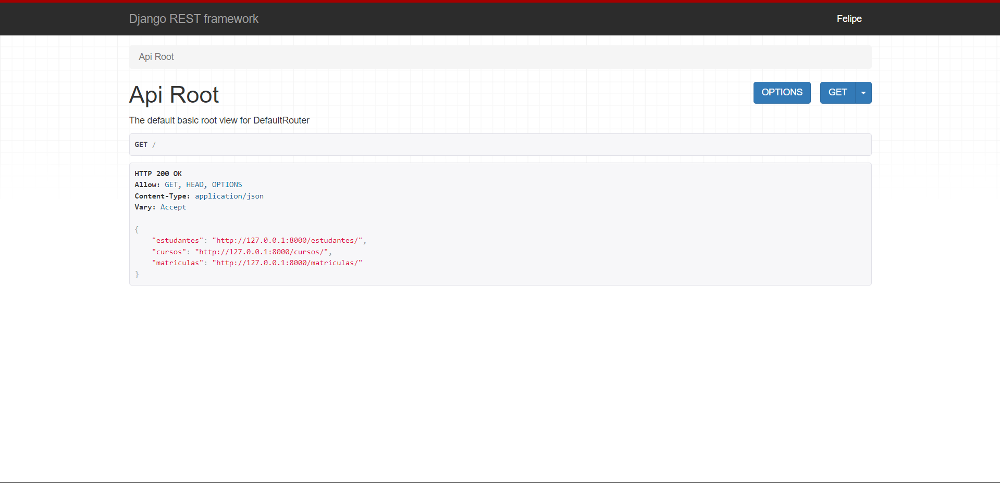
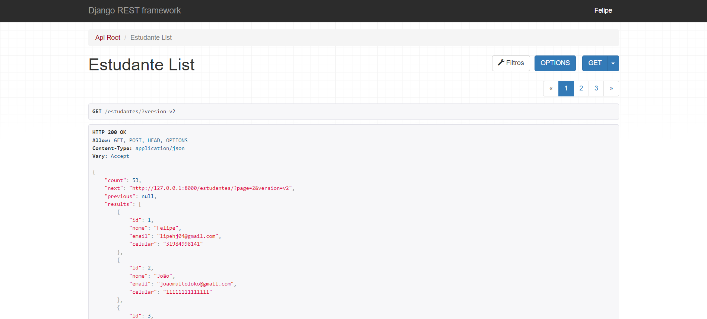
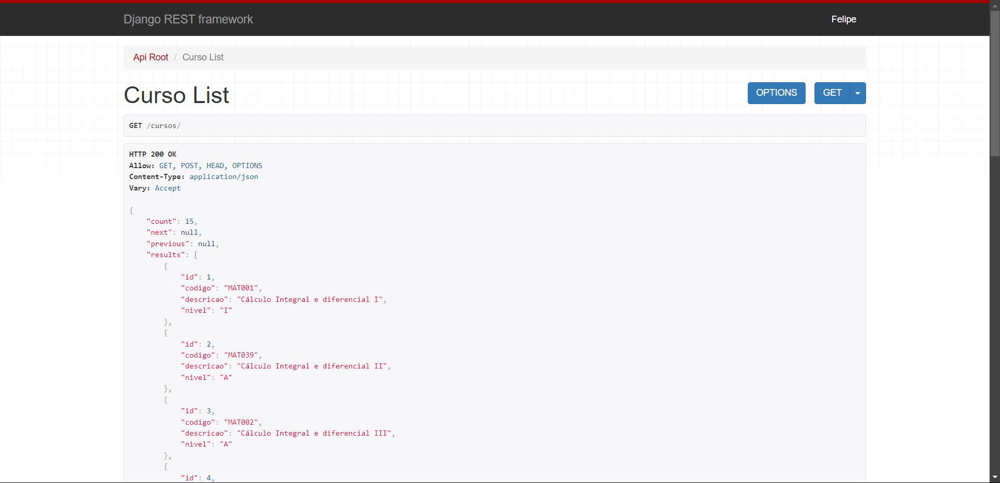
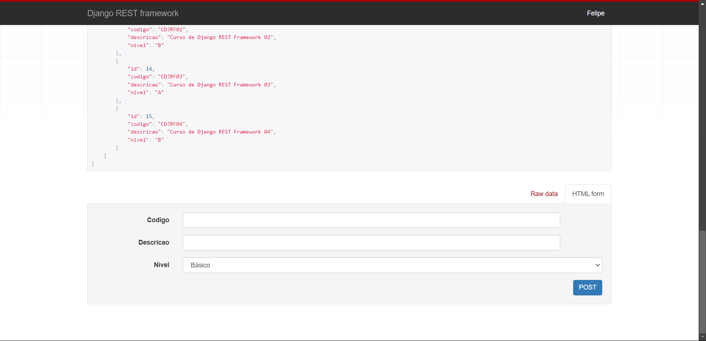
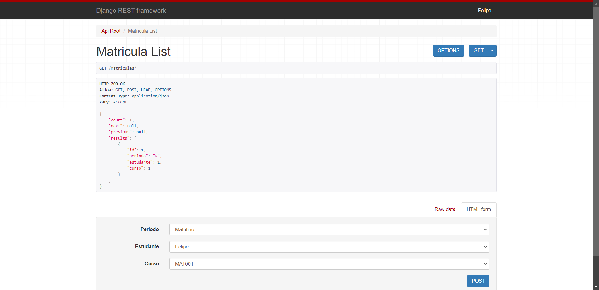

# 🚀 Projeto API Escola

## 📝 Descrição
Este projeto é uma REST API moderna desenvolvida com o Django REST FRAMEWORK. A API se propõe a funcionar como uma API de uma escola, mostrando alunos, cursos e matriculas relacionando alunos e cursos. O projeto consiste em um teste das habilidade de Django REST FRAMEWORK desenvolvidas por mim ao longo do curso fornecido pela **Alura**.

## 🛠️ Tecnologias Utilizadas
- Django5
- Django REST_FRAMEWORK3.15
- Python3.12
- ORM

## ⚙️ Funcionalidades
- Consulta de alunos cadastrados
- Consulta de cursos cadastrados
- Consulta de matrículas cadastradas
- Páginação
- Versionamento de API
- Sistema de filtro ao utilizar a API
- CRUD em todos os endpoints
- Sistema de Autenticação - Basic Authorization

## 🚀 Como executar o projeto
### Siga estas etapas para executar o projeto localmente

Clone o repositório:
```powershell
git clone https://github.com/Cronos477/apirest-escola.git
```

Entre no diretório do projeto:
```powershell
cd "apirest-escola"
```

Instale as dependências:
```powershell
pip install -r requirements.txt
```

Execute o projeto:
```powershell
python manage.py runserver
```

Acesse http://127.0.0.1:8000 no seu navegador.

## 📸 Screenshots





